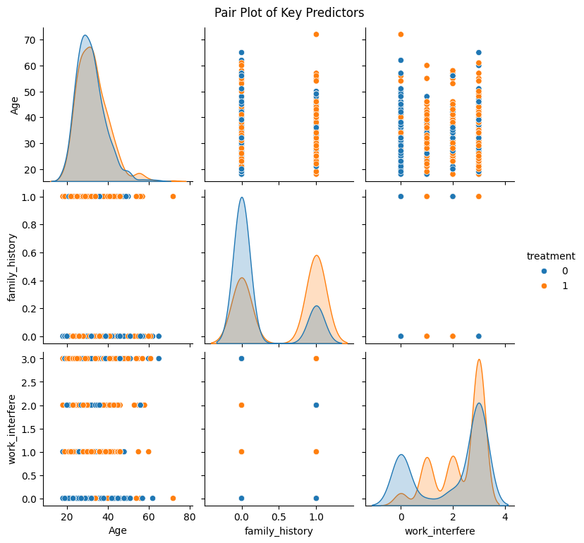

# Mental Health in Tech — Exploratory Data Analysis (EDA)


## 📌 Project Overview
The **Mental Health in Tech** dataset provides profound statistical insights into the attitudes towards and frequency of mental health disorders within the global tech workplace. This project executes a deep Exploratory Data Analysis (EDA) specifically tailored to uncover the core demographic, environmental, and corporate factors that most heavily influence an employee's decision to seek professional mental health treatment.

## 🎯 Business Objective
Help tech companies accurately understand which specific internal and demographic factors contribute to poor mental health outcomes and map out strategic areas to significantly improve corporate health and wellness support systems.

---

## 🔍 Key Findings & Visualizations

During the data wrangling phase, we aggressively standardized messy demographic data, removed invalid entries, and imputed nulls to establish a highly resilient cohort. Subsequently, we ran 20 progressive visualizations culminating in multi-variate correlations to establish the absolute strongest predictors for needing treatment. 

Here are some of the critical visualized insights:

### 1. The Power of Family History & Work Interference
Predicting who needs help isn't driven tightly by age or gender. Our Correlation Heatmaps proved that a personal family history of mental illness combined with the rate at which conditions "interfere with work" are vastly superior indicators.


### 2. Tracing the Predictors 
When mapping multi-variate intersections, visual clusters clarify the data boundaries. Employees experiencing severe "work interference" almost universally overlap into the active treatment-seeking group.



### 3. The Atmosphere of Perceived Consequence
Despite massive pushes for corporate wellness, our data reveals an intense cultural fear of stigma. Many employees, regardless of gender, actively fear that revealing a behavioral health baseline will invite negative career consequences.


---

## 🛠️ Data Wrangling Methodologies
Before charting, the dataset inherently required significant restructuring:
- **Gender Consolidation:** Transformed over 30+ messy text entries into cleanly aggregated `Male`, `Female`, and `Other` values.
- **Age Filtration:** Dropped corrupted and negative value rows, strictly enforcing `18 <= Age <= 80`.
- **Mode Imputation:** Safely imputed missing categorical logic for vital segments like 'self-employed' and 'work-interfere' via mode.
- **Refinement:** Completely dropped unusable/irrelevant columns such as textual `comments`, highly restrictive `state` strings, and irrelevant `Timestamps`.

## 💡 Strategic Business Recommendations
Based directly on our analytical evidence:
1. **Destigmatize Care Access:** Aggressively reduce the silent fear of negative consequences associated with taking mental health medical leave.
2. **Over-Communicate Channels:** Providing benefits isn't enough; employees must be constantly educated about them, as awareness is strongly correlated with treatment adoptions.
3. **Train Middleware Leadership:** Subordinates fundamentally trust middle managers more than peers. Middle management must undergo specialized psychiatric triage training.
4. **Identify Work Thresholds:** Continuous tracking of individual workloads is paramount since "work interference" is the ultimate catalyst for seeking professional intervention.

---

## 🚀 Getting Started
To view the analysis natively on your machine:
```bash
# Clone the repository
git clone https://github.com/farheenfathimaa/mental-health-tech-eda.git

# Navigate into the project directory
cd mental-health-tech-eda

# Run Jupyter Notebook
jupyter notebook EDA.ipynb
```

> **Note:** Included in this repository is the complete end-to-end Python code, natively compiled visualizations, and deeply unpacked statistical narratives within the Jupyter Notebook framework.